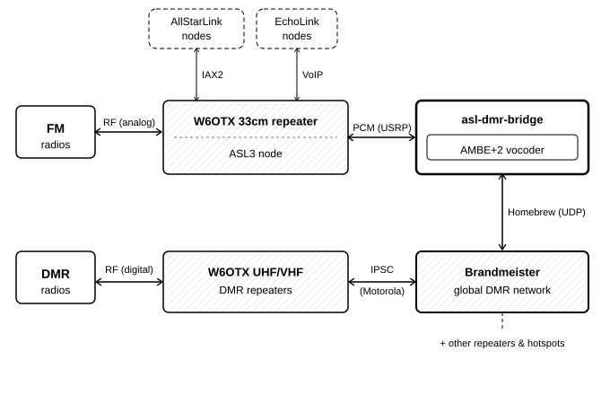

# Linking W6OTX: How We Bridged FM and DMR Without DVSwitch

*by Christopher Hoover, AI6KG*

---

If you have been active on the W6OTX repeaters lately, you may have
noticed something new and slightly magical: audio from our 33cm analog
FM machine is now seamlessly appearing on the UHF and VHF digital DMR
repeaters, and vice versa. You can key up an analog HT on 900 MHz and
cleanly chat with someone operating a digital DMR radio.

Hams familiar with digital linking might naturally assume the club is
running DVSwitch -- the most common, go-to software suite for
FM-to-DMR bridges. We are not. While DVSwitch is an impressive piece
of engineering that has served the community well, it is closed-source
freeware. It has no public bug tracker, no open repository, and no
license permitting modification or redistribution. For a club
infrastructure project, relying on a closed black box feels
antithetical to the open, experimental spirit of amateur radio.

Because I wanted something transparent, maintainable, and truly open
source, I decided to write a replacement from scratch. Here is how the
project works and how the pieces connect.

## Two Different Worlds

To understand why bridging these systems is a challenge, you have to
look at how different their underlying architectures are.

The W6OTX 33cm FM machine runs AllStarLink (ASL3). AllStarLink is a
terrific, peer-to-peer network of Asterisk-based voice nodes that
speak the IAX2 protocol directly to one another without relying on a
central routing server.  (The machine also accepts EchoLink
connections for broader accessibility.)  ASL3 passes audio between its
internal modules as raw, uncompressed PCM -- specifically, 8 kHz, 16-bit
samples.  Because audio on AllStarLink travels uncompressed, fidelity is limited
only by the original RF path.

To hook into this, the new bridge plugs into ASL3 as a USRP
endpoint. In the Asterisk ecosystem, the USRP protocol is simply a
lightweight network audio format. Audio flows in and out over a local
UDP port on the same machine, completely uncompressed and ready to
process.

On the flip side, the W6OTX UHF and VHF DMR repeaters live in a
completely different ecosystem. They connect to Brandmeister, the
one of the largest global DMR networks for hams. Because our club repeaters are
Motorola machines, they connect using IPSC (IP Site Connect) -- simply
because that is the only language those repeaters speak.

Instead of trying to mimic a complex repeater, the bridge connects to
Brandmeister a different way: via the Homebrew protocol. Homebrew is a
simpler, lightweight UDP-based protocol originally designed for
personal hotspots. By acting like a high-performance hotspot to the
Brandmeister network, the bridge can inject and extract digital audio
smoothly.

Connecting the two worlds sounds straightforward on paper: receive raw
PCM from ASL3, encode it into compressed DMR voice frames, and
transmit it via Homebrew to Brandmeister. In the other direction, you
decode incoming DMR frames back to PCM and push it to ASL3.

## The Hidden Hurdles

In reality, digital-to-analog bridging introduces a set of less-obvious
engineering challenges beyond the obvious audio transport.

* **Call Tracking and Metadata:** DMR identifies every transmission by
  source ID, destination talkgroup, slot, and color code. Analog FM has
  none of that -- it is an open squelch with no caller identity. The
  bridge maintains a PTT state machine that tracks active calls on both
  sides, resolves DMR numeric IDs to callsigns for logging, and
  arbitrates between the two worlds: while a DMR call is incoming, FM
  transmission is suppressed so the two sides do not step on each
  other.

* **PTT and Timing State:** Managing push-to-talk state between an
  untimed IP audio stream and a physical repeater requires careful
  synchronization. Cut the timing too close and you clip the first
  syllable; leave it too loose and the repeater hangs endlessly. A
  configurable hang timer holds the state open briefly after each
  transmission ends. The noise gate and hang time together also absorb
  the analog squelch tail -- the brief burst of noise after an FM user
  unkeys -- so it does not produce a spurious kerchunk on the DMR
  side.

* **Gain Staging:** Analog FM operators arrive at widely varying audio
  levels depending on their radio's deviation and mic gain. DMR's
  AMBE+2 codec is sensitive to input levels -- too hot and the vocoder
  produces artifacts; too quiet and intelligibility suffers. The bridge
  applies configurable gain stages in both directions, with per-call
  level tracking and a peak limiter, so that FM operators do not
  overdrive the vocoder and DMR operators are not inaudible on the 33cm
  machine.

But the single most significant technical bottleneck remains the voice
codec itself.

## The Elephant in the Room: Proprietary Voice Codec

DMR voice does not use open audio formats. It relies on a proprietary
codec called AMBE+2, developed by DVSI. The specification is not
public, and software implementations are controlled by copyright and
patents.

This is why most DIY FM-to-DMR setups require hardware: specifically,
the ThumbDV, a USB dongle from Northwest Digital Radio (costing around
$100) that contains a licensed, physical DVSI AMBE-3000R chip. The
chip handles all of the encoding and decoding in hardware.  W6OTX
currently uses a ThumbDV for production traffic.

The project supports two dongle-free software alternatives, both
capable of running in real time on a Raspberry Pi 4:

* **Emulated MD380 Firmware:** The TYT MD380 handles AMBE+2 using a
  software implementation that runs on its internal ARM processor. Radio
  researchers long ago reverse-engineered and documented this
  firmware. The bridge backend can actually run that exact, native
  radio firmware inside a highly optimized ARM CPU emulator called
  dynarmic. It works without a dongle, but the firmware is
  proprietary and the legal picture around extraction varies by
  jurisdiction.

* **nambe (Neural AMBE):** This is an experimental AI6KG research
  project developed alongside the bridge. Rather than emulating
  proprietary code, nambe uses machine learning. It trains small,
  efficient neural networks to mimic AMBE+2 encoding and decoding,
  using a hardware dongle as an oracle to generate training data. It
  runs entirely on original, open-source code with no proprietary
  firmware. While the decoder is already approaching
  hardware-chip quality on typical voice, the encoder is still being
  actively refined.

## Signal Flow

The diagram traces a U-shape.  Along the top, audio travels from FM
radios through the W6OTX 33cm repeater and its ASL3 node into the
bridge.  The dashed boxes above the ASL3 node show the other networks
the 33cm machine serves alongside the bridge: AllStarLink nodes
elsewhere on the internet and EchoLink users.  Down the right side,
the bridge connects to Brandmeister via Homebrew.  Along the bottom,
Brandmeister distributes the audio to the W6OTX UHF and VHF DMR
repeaters and on to DMR radios.  Digital voice travels either direction
through this path.  End-to-end latency -- FM microphone to DMR speaker
-- is dominated by the AMBE+2 encode cycle and the round-trip through
Brandmeister; in practice it falls in the same range as a VoIP phone
call.

## Written in Rust

The bridge daemon is written in Rust, a systems language that compiles
to native code with performance comparable to C and C++. Beyond
performance, Rust enforces memory safety and catches data races at
compile time rather than at runtime. The multi-threaded daemon uses
the Tokio async runtime; audio frames flow between tasks over typed
channels, and if the encoder holds a buffer, the audio pipeline cannot
touch it simultaneously -- the compiler rejects the attempt rather
than leaving it to silently corrupt audio or crash the program.

## Open Source

The project is published on GitHub under the GPL at
https://github.com/charlieh0tel/asl-dmr-bridge.  The GPL means anyone
who modifies and distributes it must publish their changes under the
same terms -- forks stay open.  Prebuilt Debian packages for Raspberry
Pi 4 are available on the releases page.  Anyone running ASL3 who
wants to experiment with a DMR link is welcome to try it.

On Brandmeister, the bridge is active on PAARA club talkgroup TG
3224295, reachable from any connected hotspot or repeater on the
network.

If you have questions or want to set up a link of your own, find me on
the W6OTX repeaters or by email.

*73 de AI6KG*
